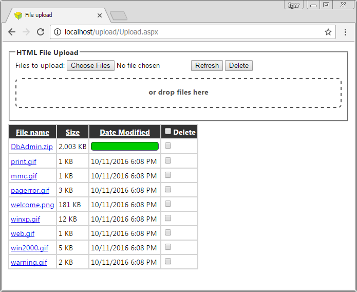
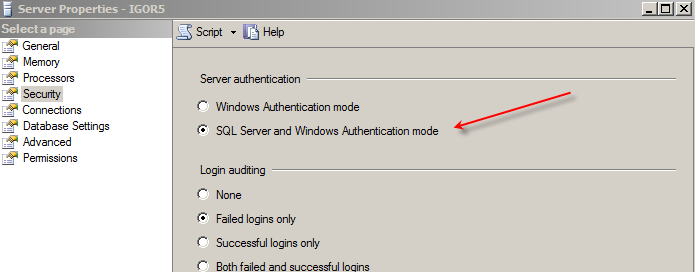
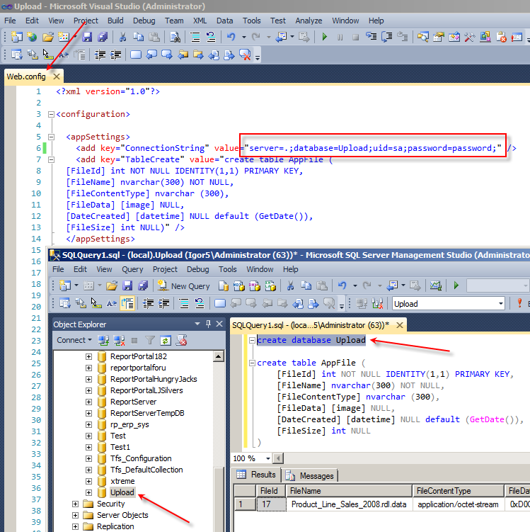

# Multiple File Upload into a Database with Progress Bar and Drag and Drop

Originally posted here: <https://www.codeproject.com/Articles/1138013/Multiple-File-Upload-into-a-Database-with-Progress/>

The ASP.NET pages let you upload, delete and browse files into a database.

## Introduction
This ASP.NET application will let you upload multiple files to a SQL Server database via drag and drop. It will show progress bar for each file as it uploads. Once uploaded, you can browse, sort and delete these files.

## Background
This is a sequel to my earlier article, Multiple file upload with progress bar and drag and drop.

## Using the Code
To use this application:
1. Download Upload.zip and unzip it to C:\inetpub\wwwroot\Upload.
2. Open SQL Server Management Studio and create "Upload" database. Make sure that SQL Server uses SQL Authentication mode.

In Notepad, open "C:\inetpub\wwwroot\Upload\Web.config" and update user name and password needed to connect to the database:

Point your browser to http://localhost/Upload/Upload.aspx.
